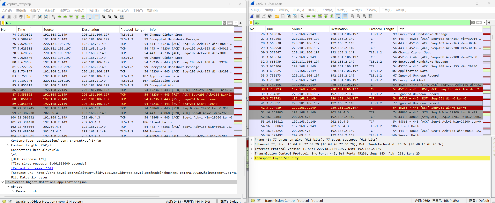
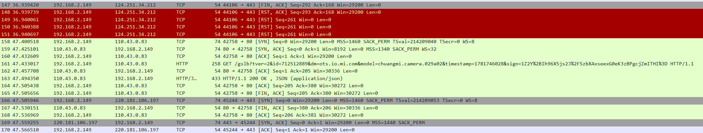
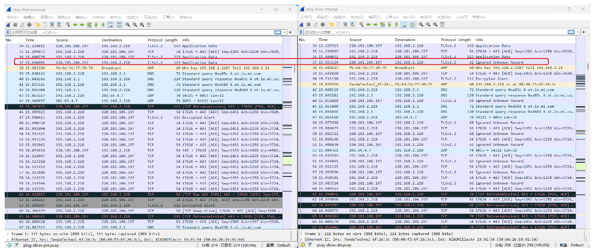

# camera
###### 1. camera连接统计

| IP              | 连接方式 | 服务       |
| --------------- | ---- | -------- |
| 110.43.87.243   | TLS  | -        |
| 124.251.34.212  | TLS  | -        |
| 220.181.106.197 | TLS  | -        |
| 202.69.4.3      | TLS  | -        |
| 39.101.90.208   | TLS  | -        |
| 202.69.4.7      | UDP  | -        |
| 42.157.163.100  | UDP  | 视频流（待确认） |
| UDP连接较多，未完全统计   |      |          |
|                 |      |          |

###### 2. 分割前后对比

###### 3. 其他发现
开始分割后，每三次连接断开都会出现一次TCP信息传输，其中model为明文设备型号，sign编码方式未知（排除base64），该通信目的未知。

  
# plug

plug全程TLS通信，每次连接断开就会更换一个ip连接对象。

下图为分割前后对比，红色方框处开始分割。

同样的，每隔3次连接中断就会出现独特的TCP信息传输。