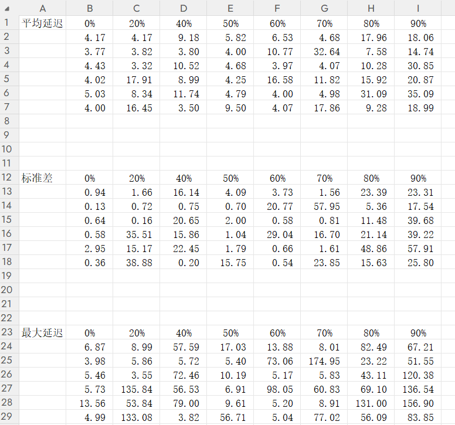
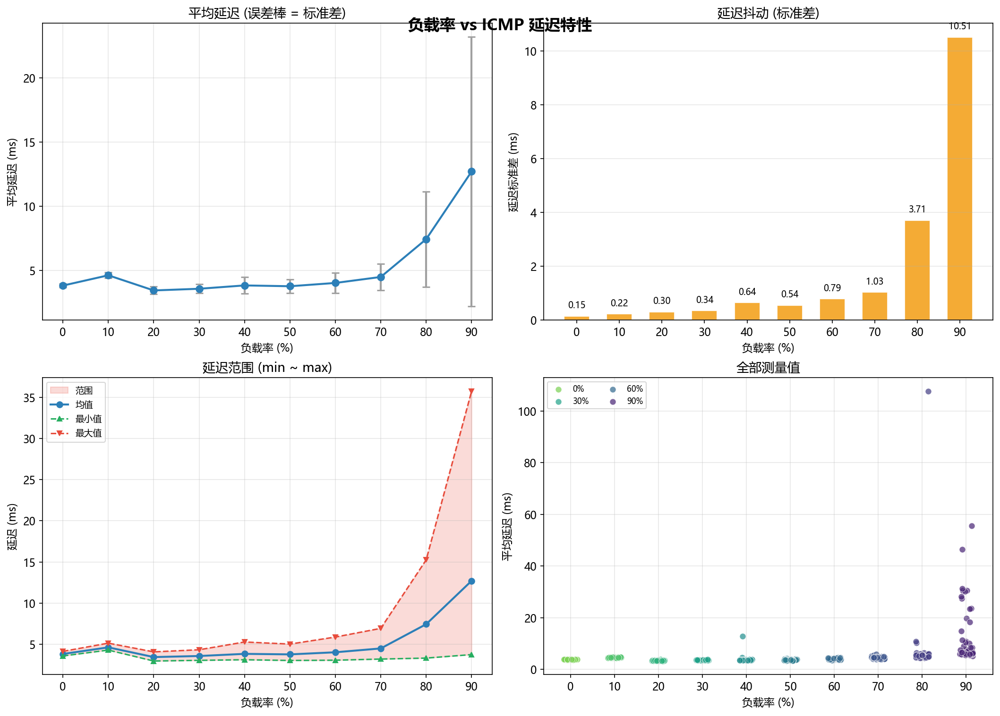
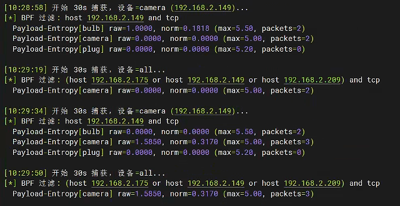

系统设计（绿色为完成，基本没有大问题，至少能运行且得到的数据相对合理可用；蓝色为正在进行）：


![[attachments/Pasted image 20260624141737.png]]

待解决问题：
1. ICMP时延、TCP时延、信息熵的归一化策略，以及信息熵为0的情况下的处理方法（信息熵可根据窗口内捕获到的数据包数量计算理论最大信息熵log_2(packet_num)）
2. 源代码模型训练收敛所需时间较长，可以探寻更优训练策略，将单个样本采集时间从30秒压缩至20秒或25秒（初步理论已形成，将p值的步长调为0.05，可更快收敛模型）。


##### 1. 网络延时问题
>分为了ICMP报文时延和TCP通信报文时延。
>ICMP时延实际上取决于网络状态。
>TCP时延则经过了分割器，取决于分割器处理时延加网络时延。
>目前的流量经由分割器分割，分割层面为TCP数据包，在IoT端自动恢复，传给模型的时延并未考虑IoT端自动恢复所花费的时间。

###### ICMP
(1) ICMP时延受到WiFi链路的影响，极其不稳定。


改进方法：四分位距法

###### TLS
TLS时延获取，目前的获取包括了应用层时延，且与模拟通信耦合度过高，不利于后续真实IoT实验，需改进。

关于TLS时延测试，在理想的实验环境下，时延随分割概率p的增大而增大，较为平缓且显而易见。
但是在探测真实IoT设备时，这个趋势就不那么明显了，多次测得的时延比较离散，即使用了四分位距方法（目前仍缺少规模化的实验记录，仅简单测试了几次）。
p=0.1:
{'avg_rtt': 56.356, 'median_rtt': 56.105, 'max_rtt': 129.313, 'min_rtt': 9.326, 'sample_count': 12}
{'avg_rtt': 39.039, 'median_rtt': 35.684, 'max_rtt': 97.446, 'min_rtt': 8.143, 'sample_count': 15}

p=0.5:
{'avg_rtt': 62.153, 'median_rtt': 59.346, 'max_rtt': 156.891, 'min_rtt': 18.002, 'sample_count': 13}
{'avg_rtt': 60.062, 'median_rtt': 49.53, 'max_rtt': 137.242, 'min_rtt': 18.029, 'sample_count': 12}

p=1:
{'avg_rtt': 75.451, 'median_rtt': 79.469, 'max_rtt': 136.673, 'min_rtt': 17.948, 'sample_count': 10}
{'avg_rtt': 65.47, 'median_rtt': 69.89, 'max_rtt': 119.516, 'min_rtt': 19.191, 'sample_count': 12}

##### 2.分割问题
问题：TCP数据包分割理论上来说是能够做到单点分割，自动恢复。但实际情况是存在IoT设备没有设置乱序列表（Out-of-order），因此仍需要在IoT一侧单独设置一个乱序列表？
回答：无需理会，数据包乱序现象是偶然发生的，即使分割数据包后数据包数量增加导致乱序概率上涨，但概率还是很低，并且该现象发生时有TCP重传机制兜底，不至于影响设备正常使用。

##### 3. 信息熵问题
###### (1) 早期发现的问题
基于TLS负载长度分布的Shannon熵
信息熵的获取，源代码的获取方式为外部采集，其可控性差。
**理由1**：


**理由2**：即使使用有规律的，相对稳定的采集数据，也可能导致利用不同设备数据训练出来的模型不一样。
比方说：
**摄像头：**
- **不分割时（P=0）**：TCP直接发送这些消息（假设每个消息恰好一个包），  
    包长度序列 = `[1400, 500, 1400, 500, …]`  
    两种长度，各占50%。  
    香农熵：
$$R=−0.5log⁡_20.5−0.5log⁡_20.5=0.5+0.5=1.0\; bit$$
- **完全分割时（P=1）**：每个1400字节的消息被随机分成若干小包（例如200~600字节），500字节消息也随机分割。  
    最终包长度可能变得非常多样，假设出现8种不同长度，概率大致相等（各12.5%）。  
    香农熵：
$$R=−8×(0.125\log_20.125)=−8×(0.125×(−3))=3.0 \;bit$$

分割带来的熵增益 = 3.0−1.0=2.0 bit3.0−1.0=2.0 bit。

**智能插座:**

- 发送的应用层消息长度序列（周期性的保活报文）：  
    `[64, 64, 64, 64, …]` （固定长度）
    
- **不分割时（P=0）**：包长度全是64。  
    香农熵：
$$R=0 bit$$
- **完全分割时（P=1P=1）**：64字节的消息只能分成有限组合（例如 `[32,32]` 或 `[30,34]`），假设出现两种长度（32和32？不对，更现实的是分成 [30,34] 两个包，长度30和34）。假设统计得到两种长度30和34，各出现50%。  
    香农熵：

$$R=−0.5log⁡20.5−0.5log⁡20.5=1.0 bit$$

分割带来的熵增益 = 1.0−0=1.0 bit。

**对比表格**（归一化熵）

| 设备      | 状态     | P=0 归一化熵 | P=1 归一化熵 | 分割增益  |
| ------- | ------ | -------- | -------- | ----- |
| 摄像头（活跃） | 高固有随机性 | 0.90     | 0.98     | +0.08 |
| 插座（空闲）  | 低固有随机性 | 0.02     | 0.23     | +0.21 |

一个活跃的摄像头即使完全不分割，其归一化熵也能达到 0.9；而一个空闲的智能插座即使全力分割，归一化熵也只有 0.2 左右。
这导致智能体无法从奖励中判断‘高熵是因为我做了好的分割’还是‘因为设备本身流量就乱’。

目前使用的解决办法：模拟服务器和客户端，稳定的信息熵参考，多设备不同特征的流量对信息熵的影响还在探讨，可用归一化解决（源代码中的归一化方法合理性还有待考究）？

目前最新的解决办法：连点器自动控制设备制造流量，单设备流量归一化如下：
```python
packet_num = len(lengths)

if packet_num > 1:
    max_entropy = math.log2(packet_num)
else:
    max_entropy = 1.0

entropy_norm = entropy_raw / max_entropy
```

多设备信息熵的归一化方式采取按流量占比的加权平均值。

###### （2）用于奖励计算的熵处理问题
**方法一**，对各个ip进行信息熵的归一化，随后各ip的归一化信息熵进行基于数据量的加权平均。
归一化熵公式：$$H_{i}=\frac{当前计算得到的信息熵=-\sum p_i\log_2{p_i}}{信息熵理论上限=\log_2(包数)}$$
该方法存在问题：
1. 分割前：【64，32，128】
2. 分割后：【32，32，16，16，64，64】
3. 二者计算得到的信息熵一致，但分割后包数增加导致信息熵理论上限增加，归一化的值反而比分割前要低

**方法二**，熵增益，取分割后的信息熵减去分割前的信息熵，其所得的熵值差为熵增益

$$H_{Dlt}=H_{after}-H_{before}$$


SAC


