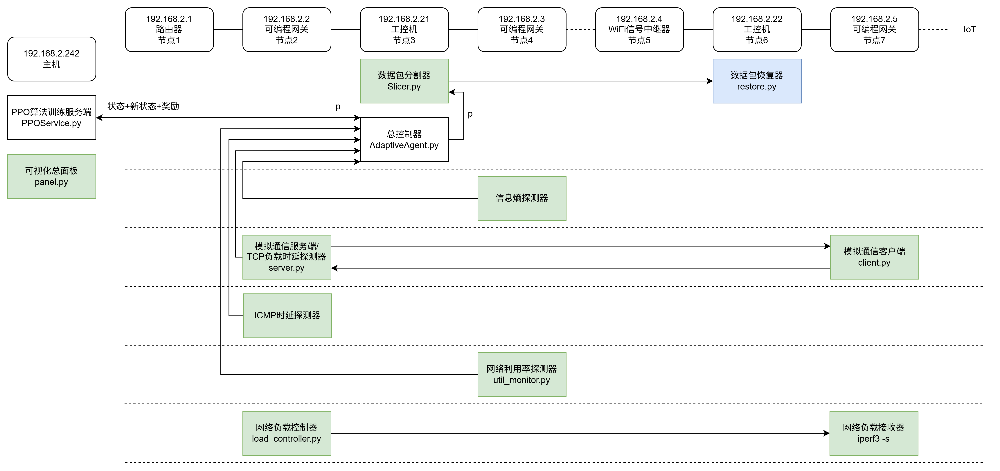

系统设计（绿色为完成，基本没有大问题，至少能运行且得到的数据相对合理可用；蓝色为正在进行）：

待解决问题：
1. ICMP时延、TCP时延、信息熵的归一化策略，以及信息熵为0的情况下的处理方法（在重构AdaptiveAgent.py跟PPOService.py的时候必须解决，预计2026.6.18着手）
2. 源代码模型训练收敛所需时间较长，可以探寻更优训练策略，将单个样本采集时间从30秒压缩至20秒或25秒。

##### 1. 网络延时问题
>分为了ICMP报文时延和TCP通信报文时延。
>ICMP时延实际上取决于网络状态。
>TCP时延则经过了分割器，取决于分割器处理时延加网络时延。
>目前的流量经由分割器分割，分割层面为TCP数据包，在IoT端自动恢复，传给模型的时延并未考虑IoT端自动恢复所花费的时间。

(1) ICMP时延受到WiFi链路的影响，极其不稳定。

改进方法：四分位距法

##### 2. 信息熵问题
信息熵的获取，源代码的获取方式为外部采集，其可控性差。
**理由1**：

**理由2**：即使使用有规律的，相对稳定的采集数据，也可能导致利用不同设备数据训练出来的模型不一样。
比方说：
**摄像头：**
- **不分割时（P=0）**：TCP直接发送这些消息（假设每个消息恰好一个包），  
    包长度序列 = `[1400, 500, 1400, 500, …]`  
    两种长度，各占50%。  
    香农熵：
$$R=−0.5log⁡_20.5−0.5log⁡_20.5=0.5+0.5=1.0\; bit$$
- **完全分割时（P=1）**：每个1400字节的消息被随机分成若干小包（例如200~600字节），500字节消息也随机分割。  
    最终包长度可能变得非常多样，假设出现8种不同长度，概率大致相等（各12.5%）。  
    香农熵：
$$R=−8×(0.125\log_20.125)=−8×(0.125×(−3))=3.0 \;bit$$

分割带来的熵增益 = 3.0−1.0=2.0 bit3.0−1.0=2.0 bit。

**智能插座:**

- 发送的应用层消息长度序列（周期性的保活报文）：  
    `[64, 64, 64, 64, …]` （固定长度）
    
- **不分割时（P=0）**：包长度全是64。  
    香农熵：
$$R=0 bit$$
- **完全分割时（P=1P=1）**：64字节的消息只能分成有限组合（例如 `[32,32]` 或 `[30,34]`），假设出现两种长度（32和32？不对，更现实的是分成 [30,34] 两个包，长度30和34）。假设统计得到两种长度30和34，各出现50%。  
    香农熵：

$$R=−0.5log⁡20.5−0.5log⁡20.5=1.0 bit$$

分割带来的熵增益 = 1.0−0=1.0 bit。

**对比表格**（归一化熵）

| 设备      | 状态     | P=0 归一化熵 | P=1 归一化熵 | 分割增益  |
| ------- | ------ | -------- | -------- | ----- |
| 摄像头（活跃） | 高固有随机性 | 0.90     | 0.98     | +0.08 |
| 插座（空闲）  | 低固有随机性 | 0.02     | 0.23     | +0.21 |

一个活跃的摄像头即使完全不分割，其归一化熵也能达到 0.9；而一个空闲的智能插座即使全力分割，归一化熵也只有 0.2 左右。
这导致智能体无法从奖励中判断‘高熵是因为我做了好的分割’还是‘因为设备本身流量就乱’。

目前使用的解决办法：模拟服务器和客户端，稳定的信息熵参考，多设备不同特征的流量对信息熵的影响还在探讨，可用归一化解决（源代码中的归一化方法合理性还有待考究）？

